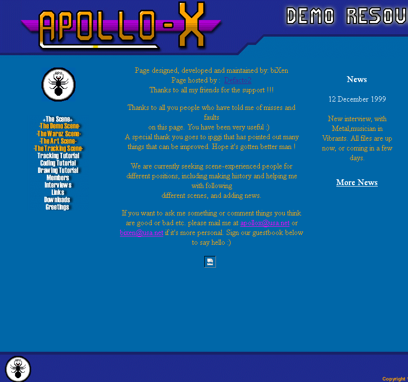

# Apollo-X Demo Resource website snapshot from 1999

The complete HTML source to a 1998 amateur demo scene website.

Apollo-X Demo Resource was an underground demo scene website created by bixen in 1997. It is typical of the era, this is the complete and original HTML source of the entire website as it was last revised on the 17th December 1999.

This code is online as a historical reference and [it can be viewed online](http://defacto2.net/wayback/apollo-x-demo-resources-1999-december-17/index.htm).

