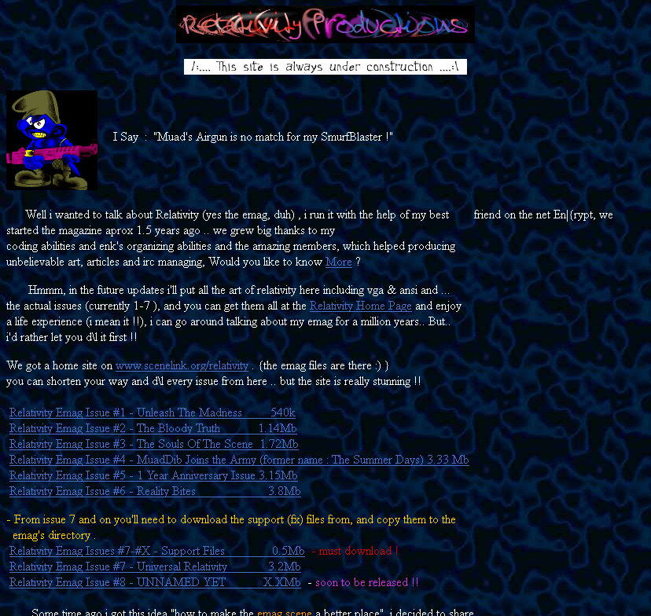

# Muad's Whq website snapshot from 1998

Muad's Whq from 1997 was a personal homepage for the programmer MuadDib.

The complete HTML source to the Maud's Whq which was a very typical mid-1990s personal homepage. It seems to have been created using Mozilla's Netscape Communicator 4 on Microsoft Windows 95.

This code is online as a historical reference and [it can be viewed online](http://defacto2.net/wayback/mauds-whq-from-1998-march-27/index.html).

