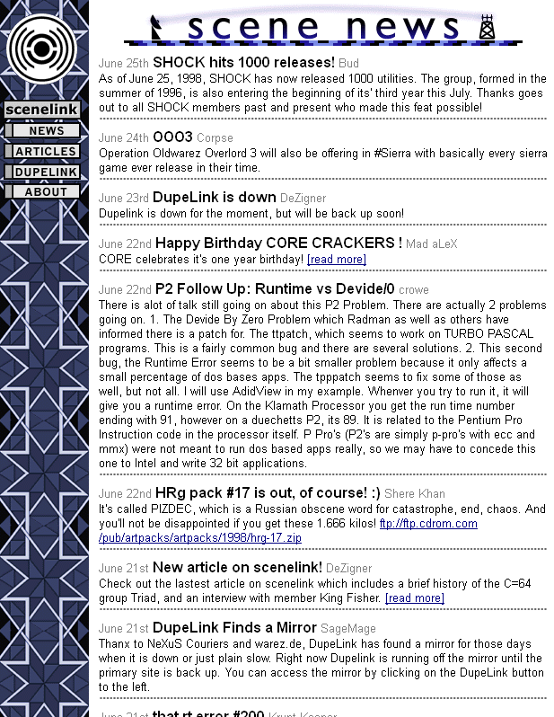

# Scenelink website snapshot from 1998

The complete HTML source to the underground website Scenelink. It was an underground pirate scene website that was popular in 1997 and 1998. Professionally produced and typical of its era, this is the complete and original HTML source of the entire website as it was last revised on the 25th June 1998.

This code is online as a historical reference and [it can be viewed online](http://defacto2.net/wayback/scenelink-from-1998-june-25/index.html).

