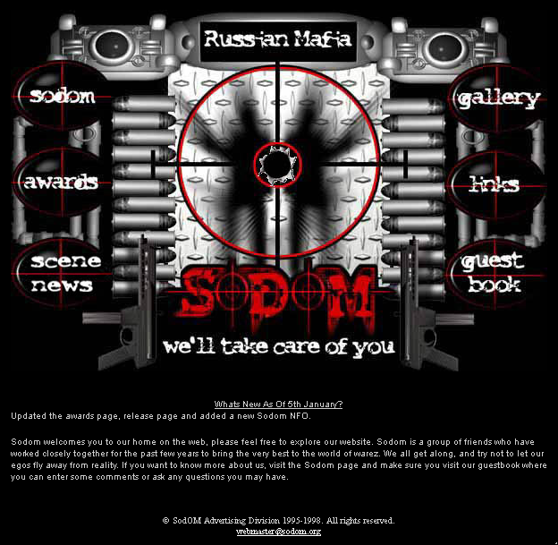

# Sodom website snapshot from 1998

The complete HTML source to the Sodom website from 5th January 1998.

Sodom was a minor international PC software pirate release group based out of Russia. This style and form of website was typical of the Internet underground during the mid to late 1990s.

This code is online as a historical reference and [it can be viewed online](http://defacto2.net/wayback/sodom-from-1998-january-5/index.html).

