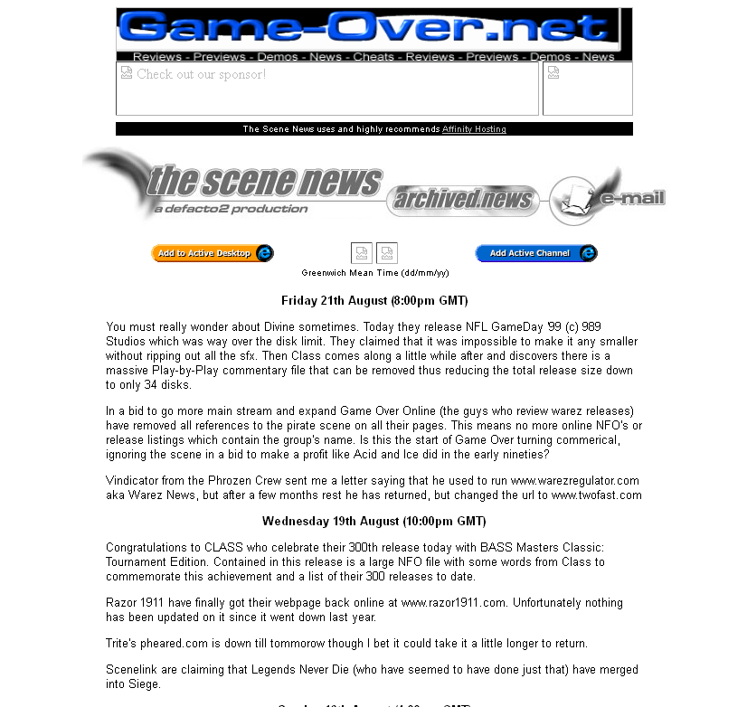

# The Scene News website snapshot from 1998

The complete HTML source to The Scene News website from 21 August 1998.

The Scene News was a very early web blog discussing the warez scene gossip and news. It was from an era when the term *blog* was not well known. All posts to the site were published by hand using a simple text editor and raw HTML markup.

This code is online as a historical reference and [it can be viewed online](http://defacto2.net/wayback/the-scene-news-from-1998-august-21/news.html).

