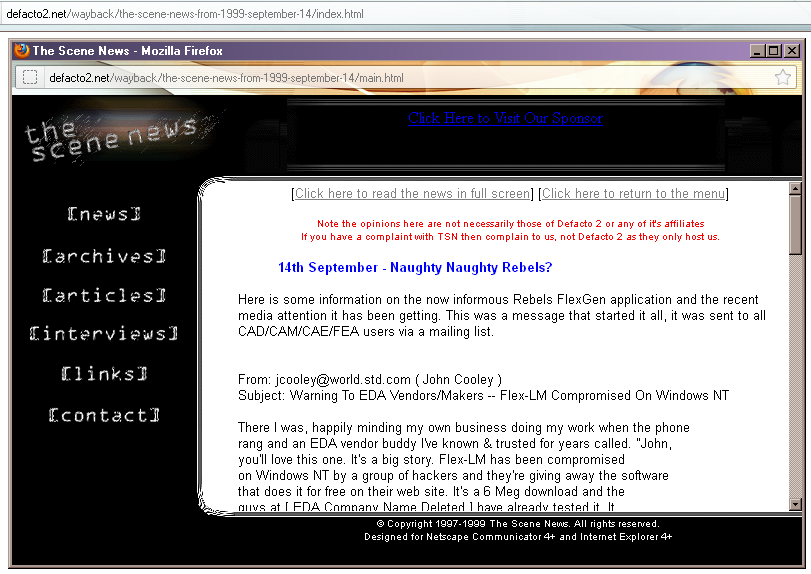

# The Scene News website snapshot from 1999.

The complete HTML source to The Scene News website from 14 September 1999.

This was the 3rd revision of The Scene News web-blog. The HTML markup was created using the authoring tool [Hippie 98 by Trout Software](https://www.google.com/search?q=Hippie+98+by+Trout+Software).

This code is online as a historical reference and [it can be viewed online](http://defacto2.net/wayback/defacto2-from-1999-september-26/index.html).

